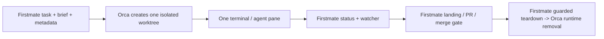
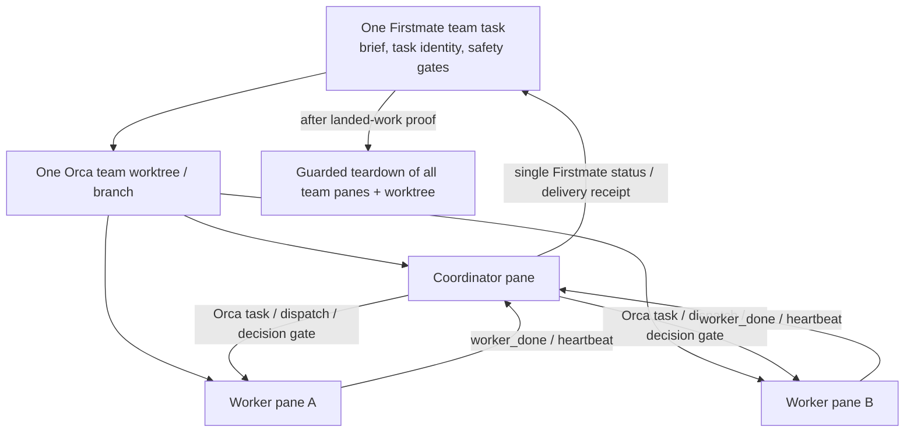

# Orca-native Firstmate: comparative architecture and roadmap

Date: 2026-07-12  
Scope: research and architecture only. No Firstmate or Orca implementation change is proposed or made by this report.

## Executive decision

Adopt a composed architecture, not a replacement:

> For an Orca-backed Firstmate task, Orca is the authoritative runtime and collaboration signal source; Firstmate is the authoritative task, safety, delivery, and approval control plane.

This applies only where `backend=orca`. It does not change the tmux reference backend, Treehouse worktree model, or the other supported runtime backends and harnesses.

The important refinement is that Orca has runtime **capability**, not autonomous lifecycle **decision authority**. Orca can create, stop, restore, or delete runtime objects. Firstmate must continue to decide whether a task may be landed, merged, discarded, or torn down, and must execute destructive Orca calls only after its existing guards pass.

The architecture splits into two tracks:

1. Improve today's supported, isolated Orca-backed task path first.
2. Introduce an explicit, opt-in `team-worktree` task kind only after its prerequisites and experiments succeed. It must never relax the normal isolated-worktree invariant.

The adversarial Judge accepted this decision and its boundaries in `data/orca-firstmate-architecture-judge-e1/report.md`.

## Evidence and confidence

| Evidence | What it established |
|---|---|
| `data/orca-world-model-a1/report.md` | Orca's durable worktree model, runtime/PTYS, pane/agent state, orchestration, restore behavior, and destructive deletion semantics. |
| `data/firstmate-world-model-b1/report.md` | Firstmate's task identity, isolation, supervision, landing/merge, teardown, portability, and current Orca adapter limits. |
| `data/shared-worktree-comparison-c1/report.md` | Why one-worktree teams are a different task shape, plus ownership and failure analysis. |
| `data/isolated-worktree-comparison-d1/report.md` | Phase-by-phase isolated lifecycle ownership, risks, adapter seams, and experiments. |
| `data/orca-firstmate-architecture-judge-e1/report.md` | Independent re-check of seven load-bearing claims and acceptance/rejection of the roadmap. |

The Judge independently confirmed the following against current source:

- Orca's `worktree rm` deletes the branch by default (`/Users/johncurtis/projects/orca/src/main/runtime/orca-runtime.ts:17068`).
- Orca orchestration is runtime-global SQLite, not a private Firstmate task store (`orca-runtime.ts:2905`).
- Orca dispatch ownership anchors to pane keys, not ephemeral `term_` handles (`src/main/runtime/orchestration/db.ts`).
- Firstmate hard-asserts an isolated worktree for normal spawns (`bin/fm-spawn.sh:671`, invoked for Orca at `:783`).
- Firstmate's Orca create path deliberately passes `--no-parent` (`bin/backends/orca.sh`).
- Firstmate currently returns `unknown` for semantic Orca busy/liveness (`bin/fm-backend.sh`).
- Firstmate teardown fails closed on recorded Orca identity rather than guessing (`bin/fm-teardown.sh`).

## World models

### Orca

Orca is a worktree-native runtime and IDE surface:

- Durable objects: project/repo registrations, worktrees (`repoId::path`), worktree metadata/lineage, pane layout, and orchestration records.
- Runtime objects: daemon-owned PTYs and agent sessions. The daemon can survive an app quit/crash; terminal handles are re-minted after a runtime restart.
- Team visibility: each worktree can contain multiple terminal panes; `orca worktree ps --json` supplies each detected agent's pane key, state, prompt, latest message, and current tool activity.
- Coordination: typed messages, task/dispatch contexts, decision gates, and `worker_done` integrity. The DB is shared across all Orca projects on the runtime.
- Human surface: panes, status dots, Agents feed, notifications, comments, and workspace-status board.

### Firstmate

Firstmate is a fleet control plane:

- Durable objects: per-home lock, task ID, brief, status/event log, task metadata, backlog, project mode, PR record, and wake queue.
- Task contract: normally one task → one isolated worktree → one backend endpoint. `state/<id>.meta` is the Firstmate routing record.
- Safety: no project writes by the primary; multi-proof landed-work requirement; captain merge authority; guarded local merge; teardown refuses dirty or unlanded work.
- Supervision: durable wake queue and beacon, turn-end guard, recovery protocol, fail-closed steering, and non-Orca backend portability.

## Shared-worktree versus isolated-worktree operation

### Current isolated task

This is the correct default. Orca already owns worktree and terminal creation for `backend=orca`; Firstmate correctly preserves task identity, approval, landing, and safe teardown.

### Target explicit team-worktree task

This must be an explicit new task kind, not a flag on normal tasks. Current Firstmate assumptions are intentionally load-bearing: single-valued terminal metadata, isolation assertions, one-endpoint supervision, and sole-owner teardown.

## Authority matrix

| Responsibility | Authority | Required boundary |
|---|---|---|
| Orca worktree / terminal / pane records | Orca executes; Firstmate initiates and records task linkage | Firstmate preserves `orca_worktree_id` and cross-checks path before teardown. |
| Agent state, agent liveness, working/idle/waiting signal | Orca is source; Firstmate consumes | Never infer semantic state solely from terminal text when Orca supplies it. |
| Fleet task identity, briefs, backlog, status grammar | Firstmate | Orca orchestration IDs do not replace private Firstmate task IDs. |
| Watcher loop, wake queue, beacon, blind-turn guard | Firstmate | Orca events can feed the existing queue; they do not replace it. |
| Worker-to-worker coordination in a team worktree | Orca orchestration, under coordinator | Firstmate does not proxy peer traffic or store it as fleet truth. |
| Work partitioning and conflict avoidance in one worktree | Coordinator | Orca provides visibility, not write isolation. |
| Landing proof, PR state, merge authority | Firstmate + captain | Orca has no landed-work or merge authority. |
| Teardown decision | Firstmate | Orca is only a post-gate executor; raw `orca worktree rm` is prohibited for Firstmate tasks. |
| Captain-visible progress board | Orca surface, Firstmate-written best-effort mirror | Orca `comment`/`workspaceStatus` never become Firstmate source of truth. |

## What is already right and what is missing

### Keep unchanged

- Firstmate's isolated default, PR/merge policy, landed-work proof, and teardown containment.
- Per-home lock, durable wake queue, status verbs, fail-closed `fm-send`, and recovery semantics.
- `state/<id>.meta` as Firstmate's task-to-runtime routing contract.
- Verified JSON-shape parsing in `bin/backends/orca.sh`.
- Non-Orca backends and Treehouse flows.

### Improve for Orca-backed work

- Consume `orca worktree ps --json` agent state instead of classifying Orca tasks from a terminal-tail regex.
- Anchor recovery to Orca worktree + durable pane identity; `term_` handles are runtime-epoch cache values, not durable identity.
- Detect an Orca-side worktree/branch deletion of a live Firstmate task and surface it as a serious safety event.
- Restore useful Orca lineage only after validating the observed lineage anomaly.
- Mirror Firstmate task state into Orca's visible comment/Kanban surfaces, one way and best effort.

### Do not do

- Do not use Orca's runtime-global orchestration database as Firstmate's durable task store.
- Do not persist terminal handles as permanent identity.
- Do not make Orca merge, determine landed status, or decide deletion.
- Do not replace Firstmate's watcher, wake queue, or guard with `orca orchestration check --wait`.
- Do not enable Orca secondmates before semantic liveness is independently verified.
- Do not permit shared worktrees through a relaxation of `validate_spawn_worktree`.

## Ranked roadmap

### Track A — isolated Orca tasks first

| Priority | Change | Candidate Firstmate files | Gate / acceptance |
|---|---|---|---|
| P1 | Consume `agents[]` for Orca busy state, agent liveness, and target enrichment. Keep `unknown` on unverified JSON or plain shells. | `bin/backends/orca.sh`, `bin/fm-backend.sh`, `docs/orca-backend.md`, `.agents/skills/firstmate-orca/SKILL.md` | E1. Scratch task reports working/idle/waiting correctly; dead agent is confidently dead; non-Orca answers unchanged. |
| P2 | Add durable pane identity and re-resolve a live terminal after restart. Retain `terminal=` only as cache. | `bin/fm-spawn.sh`, `bin/fm-backend.sh`, `bin/backends/orca.sh`, recovery docs | E2. After Orca restart, peek/send/state/teardown address the same pane without manual repair; missing pane fails closed. |
| P3 | Detect and loudly report Orca-side destruction of a live Firstmate worktree/branch. | `bin/fm-teardown.sh`, `bin/fm-watch.sh`, `docs/orca-backend.md` | E5. A scratch external deletion becomes an explicit possible-destroyed-work event, not generic staleness. |
| P4 | Restore parent lineage by dropping `--no-parent`, conditionally. | `bin/backends/orca.sh`, `docs/orca-backend.md` | Lineage experiment proves correct nesting and no dangerous parent-delete behavior. |
| P5 | Best-effort Firstmate → Orca comment and workspace-status mirror. | new helper or `bin/backends/orca.sh`; `bin/fm-spawn.sh`, `bin/fm-pr-check.sh`, `bin/fm-teardown.sh` | E8. Full lifecycle mirror works; captain edits/clobber behavior known; mirror failure never blocks lifecycle. |
| P6 | Add native Orca event wait as a source to the existing Firstmate watcher, conditionally. | `bin/fm-backend.sh`, `bin/fm-watch.sh`, `bin/backends/orca.sh` | E6 plus P1. Existing wake queue/guard remain authoritative; restart falls back safely to polling. |
| P7 | Use Orca hibernate/restart/resume as a recovery action, conditionally. | `stuck-crewmate-recovery` skill, `bin/backends/orca.sh`, docs | E3 plus P1. Hibernated is never falsely dead/stale. |
| P8 | Evaluate Orca `--agent` / `--prompt` launch path. | `bin/fm-spawn.sh`, `bin/backends/orca.sh` | E4 proves model/effort, env scrubbing, brief delivery, and turn-end hook parity. Otherwise retain typed launch. |

### Track B — explicit Orca team-worktree kind

Only consider after P1 and P2 are live and the following experiments pass:

1. Real two-to-three-pane `agents[]` fidelity and state transitions.
2. Durable re-resolution after runtime restart.
3. Dispatch to hand-created Orca panes and `worker_done` integrity.
4. `orchestration check --wait` latency/restart/cross-team isolation.
5. Concurrent-edit behavior and required file-partitioning policy.

Required design constraints:

- New task kind and code path beside `validate_spawn_worktree`; all other tasks still require isolation.
- One Firstmate team task maps to one Orca worktree/branch, plural durable pane keys, and one coordinator role.
- Firstmate talks only to coordinator; coordinator uses Orca orchestration for worker peers.
- Firstmate retains one team delivery receipt, landed proof, PR process, and safe teardown decision.
- Teardown enumerates every team pane before the same id/path and landed-work gates.
- Human direct manipulation through Orca is authoritative but must be reconciled into Firstmate status/recovery.

## Experiments before implementation

- E1: `worktree ps agents[]` fidelity for a normal Firstmate Orca crewmate, including plain shell and permission state.
- E2: pane-key / terminal re-resolution across an Orca restart.
- E3: hibernation and Firstmate watcher interaction.
- E4: Orca-launch versus Firstmate-launch parity for launch arguments, env, brief, and hooks.
- E5: external Orca deletion of a scratch Firstmate worktree, including branch survival/detection.
- E6: Orca managed-hook cohabitation with Firstmate turn-end hooks and watcher event source.
- E7: deeper terminal-read cursor pagination.
- E8: comment/workspace-status write cost and human-edit clobber behavior.

The audit also leaves open: whether an external-worktree visibility/import CLI can bridge mixed Treehouse fleets, whether Orca externally exposes `preserveBranchOnDelete`, and how direct captain worker-pane intervention should interact with a coordinator dispatch.

## Fork posture

Use the captain fork as the implementation authority, while retaining an explicit upstream-sync practice.

On 2026-07-12, the captain fork `curtis-arch/firstmate` was verified to include upstream `kunchenguid/firstmate` `main` plus two fork commits. Upstream SHA `ad9f3a7` is an ancestor of fork SHA `d945dd6`; the fork is `0` commits behind and `2` commits ahead. Verification: `data/sync-curtis-fork-f1/report.md`.

Recommended adoption sequence before P1 implementation:

1. Treat `curtis-arch/firstmate:main` as the operational source of truth.
2. Add an upstream remote/sync document that requires fetch, ancestry comparison, normal fast-forward where possible, and deliberate review of any divergence—never force-push upstream into the fork.
3. Land each Track A item as an independently tested change in the fork.
4. Keep Orca experiments in disposable/scratch worktrees until their acceptance gates pass.
5. Rebase/merge upstream deliberately only after reviewing impacts on the Orca adapter and its safety tests.

## Completion statement

This report answers the captain's question at the architecture level: Firstmate should use Orca much more natively for worktree/terminal/agent/pane runtime reality and visible collaboration, while Firstmate must remain the guardrail that owns task identity, fleet supervision, delivery, approvals, and safe destruction. The recommended path is incremental and evidence-gated, preserving Firstmate's existing safety and portability strengths.
